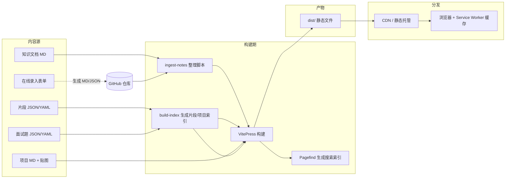

# 执码者工作知识库 — 技术设计文档

> 状态：设计稿 v3.1（新增首页快速检索 / RAGFlow 风格 Hero 搜索）
> 约定：纯前端、无数据库、静态托管（部署由你负责）
> 底座：VitePress（Vue3 + Vite）+ SSG 构建

---

## 1. 目标与范围

做一个**个人/团队执码者工作知识库**，满足：

- **四类内容整合**
  1. 多年积累的 Markdown 知识文档（量大、需整理）
  2. 结构化代码片段（带语言/标签/分类，可检索、可复制）
  3. Git 项目展示（你整理成「贴图 + MD 说明 + git 地址」，站点只负责呈现）
  4. 面试题库（一卡片一题，支持难度/标签筛选）
- **在线录入**：在浏览器里填结构化表单 → 自动生成规范 MD/JSON → 落盘到仓库（无后端）
- **检索优先（核心）**：首页以醒目的一站式搜索框为主入口，输入即搜、精准定位片段（类 RAGFlow 体验）——这是知识库存在的根本目的。
- **全站搜索** + 标签/分类聚合
- **离线可读**（PWA 离线）
- **无数据库、纯前端**：所有内容即文件，构建期变成静态产物，靠 CDN + 浏览器缓存分发

非目标：不做后端服务、不做用户系统、不做评论/协作编辑。

---

## 2. 技术选型与理由

| 维度 | 选型 | 理由 |
|------|------|------|
| 站点框架 | **VitePress** (Vue3 + Vite) | MD 是一等公民；构建极快；主题可扩展，原生支持自定义 Vue 组件与自定义布局；契合「文档 + 结构化片段 + 项目展示 + 面试题」的混合形态 |
| 全文搜索 | **Pagefind** | 构建期生成索引，零后端；支持按标签/分类过滤；对静态站、大体量 MD 友好 |
| 结构化数据 | JSON / YAML | 代码片段、面试题、项目索引用结构化数据，构建期 `import`，前端直接消费 |
| 在线录入 | 浏览器表单 + **双路径落盘**（见 §7） | 无后端前提下，用「下载/复制 + GitHub 深链」或「GitHub API 直提交」实现持久化；支持笔记/片段/项目/面试题四种内容 |
| 缓存 | HTTP CDN 缓存 + 可选 Service Worker (PWA) | 无 DB，靠静态资源缓存策略 + 离线 SW 保证体验 |
| 构建/部署 | 你负责（见 §12 约定） | 部署环节不在本设计范围，仅给出契约 |

> 为何不选 Docusaurus / Astro：VitePress 对「以 MD 为主、少量结构化数据驱动页面、需自定义组件」的形态最轻、最快、定制成本最低，且 Vue 组件生态便于做片段浏览器/录入表单等交互。

---

## 3. 架构总览



关键点：**在线录入不直接写数据库**，而是生成规范文件后回写仓库（触发重新构建），与「手工维护 MD」走同一条流水线。

---

## 4. 信息架构与目录结构

### 4.1 站点路由

| 路由 | 内容 |
|------|------|
| `/` | 首页（**中央 Hero 大搜索框**为主入口 + 导航 + 统计 + 最近更新 + 热门标签） |
| `/notes/...` | 知识文档（按分类分子目录） |
| `/snippets/` | 代码片段浏览器（数据驱动、可筛选/搜索） |
| `/projects/` | Git 项目卡片列表 |
| `/projects/<slug>` | 单个项目详情（贴图 + 说明 + git 链接） |
| `/questions/` | 面试题库（卡片网格 + 难度/标签筛选 + 抽屉详情） |
| `/tags/<tag>` | 标签聚合页（可选，由搜索/侧边栏承担亦可） |
| `/search` | 全站搜索（Pagefind UI） |
| `/entry` | 在线录入工具 |

### 4.2 仓库目录

```
knowledge-base/
├── docs/                         # VitePress 源
│   ├── .vitepress/
│   │   ├── config.ts             # 站点配置、导航、侧边栏、markdown 选项
│   │   ├── theme/
│   │   │   └── index.ts          # 自定义主题：注册组件与布局
│   │   └── data/                 # 构建期生成的索引（snippets/projects）
│   ├── public/
│   │   └── assets/               # 静态资源（图片等，见 §9）
│   ├── index.md                  # 首页
│   ├── guide/                    # 使用说明 / 贡献指南
│   ├── notes/                    # 知识文档（一级板块 → 二级分类 → 三级主题 → 四级专题）
│   │   ├── frontend/
│   │   │   ├── html-css/
│   │   │   │   ├── html/
│   │   │   │   ├── css/
│   │   │   │   └── ...
│   │   │   ├── js-ts/
│   │   │   ├── frameworks/
│   │   │   │   ├── vue/
│   │   │   │   │   ├── vue3/
│   │   │   │   │   ├── pinia/
│   │   │   │   │   └── ...
│   │   │   │   ├── react/
│   │   │   │   └── ...
│   │   │   └── ...
│   │   ├── backend/
│   │   ├── devops/
│   │   ├── tools/
│   │   ├── algorithm/
│   │   ├── ai/
│   │   └── digest/
│   ├── snippets/
│   │   ├── index.md              # 挂载 <SnippetBrowser/>
│   │   └── data/snippets.json    # 结构化片段数据
│   ├── questions/
│   │   ├── index.md              # 挂载 <QuestionBank/>
│   │   └── data/questions.json   # 结构化面试题数据
│   └── projects/
│       ├── index.md             # 挂载 <ProjectList/>（读 _data/projects.json）
│       ├── _data/projects.json  # 构建期扫描生成
│       └── <slug>.md            # 各项目详情（frontmatter + 正文）
├── src/
│   └── components/
│       ├── SnippetBrowser.vue    # 片段浏览器（筛选/复制/高亮）
│       ├── QuestionBank.vue      # 面试题卡片网格 + 筛选
│       ├── QuestionDetail.vue    # 单题详情（抽屉/页面）
│       ├── ProjectCard.vue       # 项目卡片
│       ├── ProjectList.vue       # 项目列表（索引驱动）
│       ├── EntryForm.vue         # 在线录入表单（笔记/片段/项目/面试题）
│       ├── HeroSearch.vue        # 首页 Hero 检索框 + 实时下拉结果（调用 searchProvider）
│       ├── SearchProvider.ts     # 搜索抽象（Pagefind 实现，预留 embedding 实现）
│       └── TagList.vue
├── scripts/
│   ├── ingest-notes.mjs          # 现有 MD 整理/导入
│   ├── build-index.mjs           # 扫描 projects/*.md 生成 projects.json
│   └── entry-export.mjs          # 在线录入 → MD/JSON 生成逻辑（也可在前端跑）
├── package.json
└── DESIGN.md
```

---

## 5. 内容模型（Schema）

### 5.1 知识文档 Note（frontmatter）

```yaml
---
title: 标题
category: frontend          # 对应 notes/ 下的子目录
tags: [vue, ts, 性能]
date: 2026-08-20
summary: 一句话摘要（用于卡片/搜索结果）
difficulty: 中             # 可选：入门/中/高级
aliases: [别名1, 别名2]    # 可选：用于搜索别名
---
```

### 5.2 代码片段 Snippet（JSON）

```json
{
  "id": "debounce-ts",
  "title": "TypeScript 防抖",
  "language": "typescript",
  "tags": ["ts", "utils", "高频"],
  "description": "通用的防抖函数，支持立即执行与 cancel",
  "code": "export function debounce<T extends (...a:any[])=>void>(fn:T, wait=300, immediate=false){...}",
  "source": "https://github.com/...",   // 可选
  "createdAt": "2026-08-20"
}
```

片段库 = `snippets/data/snippets.json`（数组）。构建期 `import` 进 `SnippetBrowser`。
题库 = `questions/data/questions.json`（数组）。构建期 `import` 进 `QuestionBank`。

### 5.3 Git 项目 Project（frontmatter + 正文）

```yaml
---
title: 项目名
cover: /assets/projects/xxx.png   # 贴图
tags: [vue, 工具, 开源]
repo: https://github.com/you/proj # git 地址
demo: https://demo.com             # 可选
summary: 这个项目解决了什么问题
status: 维护中                     # 可选：维护中/归档/实验
---
正文：功能亮点、技术栈、使用方式（你整理好的 MD 说明）
```

项目列表页由 `build-index.mjs` 扫描 `projects/*.md` 的 frontmatter 生成 `projects.json`，`ProjectList` 渲染卡片。

### 5.4 面试题 Question（JSON）

```json
{
  "id": "two-sum",
  "title": "两数之和",
  "difficulty": "easy",
  "type": "algorithm",
  "tags": ["array", "hash-map"],
  "content": "给定整数数组 nums 与整数 target，返回和为 target 的两数下标...",
  "hint": "可以用哈希表把查找时间降到 O(1)...",
  "answer": "...",
  "code": "function twoSum(nums, target) { ... }",
  "source": "LeetCode 1",
  "createdAt": "2026-08-20"
}
```

题库 = `questions/data/questions.json`（数组）。难度 `easy/medium/hard`；纯静态题库，题目展示与交互由前端承载（见 §6.4），不引入练习进度状态机。

---

## 6. 四大模块整合方案

### 6.1 知识文档（notes）
- 直接利用 VitePress 原生的 MD → 页面能力。
- 侧边栏由 `config.ts` 按 `notes/` 子目录自动/手动聚合。
- 代码高亮、Mermaid、容器组件等 VitePress 原生支持。
- 现有 MD 的整理见 §10。

### 6.2 代码片段（snippets）
- 数据驱动：`SnippetBrowser.vue` 读取 `snippets.json`。
- 能力：按语言/标签筛选、关键词过滤、点击复制、语法高亮（Shiki，VitePress 自带）、按热度/时间排序。
- 文档内复用：提供 `<Snippet id="debounce-ts" />` 组件，可在任意 MD 中内嵌片段。
- 新增片段两种方式：①直接编辑 `snippets.json`；②通过「在线录入」（§7）生成后合并。

### 6.3 Git 项目（projects）
- 你整理好每个项目的 MD（贴图 + 说明 + git 地址），放入 `projects/<slug>.md`。
- `build-index.mjs` 在构建期扫描 frontmatter → `projects.json`。
- `ProjectList` 渲染卡片网格（封面图 + 标题 + 标签 + 「查看源码」按钮跳 `repo`）。
- 详情页即该 MD 渲染，顶部展示封面与 git 链接。

### 6.4 面试题库（questions）
- 数据驱动：`QuestionBank.vue` 读取 `questions.json`。
- 卡片布局：桌面 3 列 / 平板 2 列 / 手机 1 列；每张卡片展示标题、难度徽标、标签、题干摘要。
- 筛选：搜索框 + 难度下拉（简单/中等/困难）+ 标签 chips。（**不做练习进度状态机**——题目为纯静态题库，无"已掌握/尝试中"等状态）
- 详情：点击卡片弹出抽屉/Modal，展示完整题干、提示（可展开）、答案（可展开）、参考代码、来源链接；列表页不离开。
- 新增题目：直接编辑 `questions.json` 或通过「在线录入」（§7）生成后合并。

---

## 7. 在线录入方案（无后端持久化）

这是纯前端方案里唯一的"写入"环节。核心是：**表单生成规范文件 → 回写仓库 → 触发重新构建**，全程不碰数据库。

### 7.1 录入表单（EntryForm.vue）
- 四种模式：笔记 / 片段 / 项目 / 面试题
- 自动处理：slug 生成、frontmatter 拼装、标签归一化、代码块包裹、必填校验
- 输出预览：实时显示将生成的 MD/JSON

### 7.2 落盘路径（**已确认：默认路径 A**）

**路径 A（默认，零 token 暴露）**
- 生成文件后提供「复制 Markdown」+「下载文件」
- 并提供 **GitHub "New File" 深链**：
  `https://github.com/<owner>/<repo>/new/<branch>?filename=<path>&value=<content>`
- 用户点一下跳到 GitHub，确认即提交，触发你那边的重新构建
- 优点：无密钥、无后端、绝对安全；缺点：需手动点一次提交

**路径 B（可选，直接提交）**
- 用户在前端填入 GitHub Token（仅存 `sessionStorage`，关闭即清）
- 调用 GitHub Contents API (`PUT /repos/{o}/{r}/contents/{path}`) 直接建文件
- 需配置 `owner/repo/branch`（站点 config 暴露）
- 优点：一键入库；缺点：Token 在客户端，仅适合个人自用的私有仓库场景

> 设计建议：**默认走 A**，把 B 作为"高级模式"可选开启。这样既安全又灵活。

---

## 8. 搜索方案（Pagefind）

- 在 VitePress `build` 之后跑 `pagefind --site dist`，对产物建全文索引。
- 集成：在站点注入 Pagefind 的 UI（或自定义搜索框组件调用 `pagefind.search()`）。
- 过滤：利用 Pagefind 的 `data-pagefind-filter` 给页面打标签/分类，支持「按标签/分类筛选」。
- 片段与项目页同样被索引，全站统一搜索。
- 体量友好：索引在构建期生成，浏览器只加载分片索引，不卡。

### 8.1 首页快速检索（RAGFlow 风格）

知识库的最终目的是"查得到、查得准"，首页以搜索为绝对主入口（参考 RAGFlow 的 "Ask anything" 体验）：

- **Hero 大搜索框**：首页中央全宽搜索框，进入即自动聚焦；不堆导航，先把检索顶到最前。
- **输入即搜（实时下拉）**：监听输入（debounce ~150ms）调用 `pagefind.search()`，下方实时浮出 Top N 结果预览——每条含「类型徽标（笔记/片段/项目/面试题）+ 标题 + 所属路径 + 高亮片段」，点击直达。
- **片段级精准定位**：Pagefind 自带关键词高亮与片段截取，命中处直接标出，省去在长文里翻找。
- **回车进全站结果页**：按 Enter 跳 `/search` 展示完整分页结果 + 过滤侧栏。
- **热门标签/分类快捷入口**：搜索框下方一排 chips（如 Vue / 并发 / JVM / 面试题），点击即按该标签过滤，降低"不知道搜什么"的门槛。
- **能力边界（务实）**：当前为**关键词全文检索**（Pagefind），已能满足"快速 + 精准片段定位"。若未来要语义级/近义检索，可在浏览器端引入 `transformers.js` 跑 embedding + 本地向量检索（纯前端可达成，但首包体积与首搜延迟显著上升）。**本期不做**，仅在架构上预留——搜索组件抽象为可替换的 `searchProvider`，未来换实现不改动 UI。

`package.json` 脚本示例：

```json
{
  "scripts": {
    "dev": "vitepress dev docs",
    "build": "vitepress build docs && pagefind --site docs/.vitepress/dist",
    "preview": "vitepress preview docs"
  }
}
```

---

## 9. 缓存与资源管理（无 DB）

### 9.1 静态资源缓存策略（交给 CDN/托管层配置）

| 资源类型 | Cache-Control | 说明 |
|----------|---------------|------|
| 带 hash 的 JS/CSS（`assets/`） | `public, max-age=31536000, immutable` | 内容指纹，永久缓存 |
| HTML 页面 | `public, max-age=0, must-revalidate` | 内容更新需重新校验 |
| Pagefind 索引分片 | `public, max-age=86400` | 每日可刷新 |
| 图片/字体 | `public, max-age=2592000` | 月级缓存 |

### 9.2 二进制资源（图片/贴图）存储
- 当前无大文件：所有资源（图片/贴图/封面）直接入 `docs/public/assets/`，随仓库走，最简单，零对象存储依赖。
- 未来若有大图/视频/大文件：再评估对象存储/CDN，MD 用绝对 URL 引用（策略预留，现在不做）。
- 你部署时，CDN 天然承担边缘缓存，无需自建。

### 9.3 离线（可选 PWA）
- 引入 `@vite-pwa/...` 或 `vite-press-plugin-pwa`，加 Service Worker。
- 策略：已访问页面 + 静态资源 `stale-while-revalidate`；首次访问缓存壳。
- 让知识库在断网时仍可查阅已加载内容，契合"工作知识库"场景。

---

## 10. 现有 MD 整理 / 迁移方案

你有多年的 MD 积累且"还需要整理"，提供**工具化整理**而非手工搬家：

### 10.1 `ingest-notes.mjs` 流程
1. **扫描**：读入你指定的源目录（现有 MD 集合）。
2. **解析 frontmatter**：缺失则推断——标题取首个 H1，日期取文件 mtime，分类按所在路径/关键词建议。
3. **归一化**：slug、标签小写去重、补全 `summary`。
4. **去重**：按标题/内容哈希识别重复，输出重复清单。
5. **生成审计报告**：`ingest-report.json` / CSV，列出「建议分类、缺失字段、疑似重复、待人工决策项」。
6. **人工复核**：你确认分类与去重结果。
7. **落库**：将归一化后的 MD 写入 `docs/notes/<category>/`。

### 10.2 分类体系（已落地，可继续调）

笔记按「一级板块 → 二级分类 → 三级主题 → 四级专题」建文件夹；热门三级主题（Vue / React / Spring Boot / MySQL）已拆到四级。

```
前端
  HTML / CSS
    HTML 语义化 · CSS 核心 · 响应式布局 · CSS 架构
  JavaScript / TypeScript
    JavaScript 核心 · TypeScript · ES 新特性 · 异步编程
  框架生态
    Vue → Vue 3 Composition API / Pinia / Vue Router / Nuxt.js
    React → React 核心 / Redux·Zustand / React Router / Next.js
    Svelte · 状态管理
  工程化
    构建工具（Vite / Webpack）· Monorepo · 代码规范 · 测试 · 设计系统
  性能优化
    加载性能 · 运行时性能 · 渲染优化 · CDN 与资源优化
  浏览器原理
    渲染流水线 · 事件循环 · 存储机制 · 浏览器安全 · 浏览器网络

后端
  Java / Spring
    Spring Boot → Spring 核心 / 数据访问 / 安全与认证
    Spring Cloud · JVM 原理 · 并发编程
  Node.js
    Node.js 核心 · NestJS · Express / Koa · 包管理
  数据库
    MySQL → 索引 / 事务 / 查询优化
    PostgreSQL · MongoDB · Redis · SQL 优化
  微服务 / 分布式
    服务设计 · 注册发现 · 分布式事务 · API 网关 · 一致性协议
  消息队列
    Kafka · RabbitMQ · RocketMQ · 消息模式
  缓存
    Redis 实战 · 本地缓存 · 缓存策略 · 缓存一致性

运维
  Linux · 容器 / Kubernetes · CI / CD · 监控告警 · 云服务 · 网络

工具
  Git · 编辑器 / IDE · 调试工具 · 命令行 / Shell · 效率工具 · 协作工具

算法
  数据结构 · 排序算法 · 动态规划 · 图论 · 字符串 · 面试高频

AI
  大模型应用 · Prompt 工程 · RAG / Agent · AI 辅助编程 · 模型部署 · AI 工程化

读书笔记
  技术书籍 · 架构设计 · 软技能 · 团队管理 · 行业认知
```

> 分类可继续按需扩展；新增分类时只要新建目录并在 `docs/.vitepress/config.ts` 的 `notesSidebar` 中声明即可被侧边栏和搜索索引覆盖。

---

## 11. 主题与 UI

- **响应式布局参考原型**：PC 用左侧固定侧边栏（≈220px），平板用顶部 sticky 导航，手机用底部 Tab Bar；主内容区最大宽度约 1240px，卡片网格随断点变化。参考的是布局结构，**不抄原型深色主题**。
- **视觉风格**：沿用你偏好的「玻璃拟态 + 浅蓝科技风」（主色 `#1770fc`），明亮背景 + 卡片阴影 + 圆角，拒绝沉闷暗色。原型仅作布局与信息层级参考，配色/内容全部重新设计。
- **首页 Hero 检索区**：顶部品牌 + 一句话定位，下方全宽 Glassmorphism 搜索框（聚焦时光晕 `#1770fc`、输入即搜），再下热门标签 chips；统计与最近更新降为次级区块置于下方。检索是首页第一视觉重心（类 RAGFlow）。
- 组件风格：卡片（card）、徽标（badge）、胶囊 chips、按钮统一圆角；代码块用 Shiki 高亮。
- 组件库：VitePress 自带 + 少量自定义 Vue 组件，不引重型 UI 库，保持轻量。

---

## 12. 构建与部署约定（你负责部署，仅给契约）

- 构建命令：`pnpm build`（含 Pagefind 索引）。
- 产物目录：`docs/.vitepress/dist`。
- 部署触发：仓库 push → 你的托管重新拉取构建（在线录入走 §7 路径 A/B 最终也是 push）。
- 你需要在托管层配好 §9.1 的缓存头。
- 域名：你绑定到自有域名，CNAME/NS 由你处理。

---

## 13. 风险与待确认项

| # | 待确认项 | 状态 | 结论 |
|---|----------|------|------|
| 1 | 在线录入落盘方式（§7） | ✅ 已确认 | 路径 A：表单生成 MD/JSON → 回写仓库 → 触发重建（零 token 暴露） |
| 2 | 视觉风格 | ✅ 已确认 | 玻璃拟态 + 浅蓝科技风（主色 `#1770fc`）、明快 |
| 3 | 现有 MD 量级 | ✅ 已确认 | ~100 篇、体量小；侧边栏分组即可，搜索无需分页/分片 |
| 4 | 图片等资源存储 | ✅ 已确认 | 全入仓库 `docs/public/assets/`，暂无大文件，不引对象存储 |
| 5 | PWA 离线 | ✅ 已确认 | 加 PWA 离线（Service Worker，已访问页面断网可查） |
| 6 | 面试题详情展示形式 | ✅ 已确认 | 抽屉/Modal 内展开，列表页不离开 |
| 7 | 面试题练习进度 | ✅ 已确认 | 不需要练习进度；移除状态机/localStorage，纯静态题库浏览 |

---

## 14. 实施路线（分阶段，先不编码）

- **Phase 0** — 设计确认（本文档评审通过，确认 §13 待办项）
- **Phase 1** — 脚手架：VitePress 初始化 + `config.ts` + 自定义主题骨架
- **Phase 2** — notes 模块 + `ingest-notes.mjs` 整理现有 MD
- **Phase 3** — snippets 模块（数据 + SnippetBrowser + 内嵌组件）
- **Phase 4** — projects 模块（MD + build-index + ProjectList/Card）
- **Phase 4.5** — questions 模块（题库数据 + QuestionBank 卡片筛选 + 本地进度）
- **Phase 5** — 搜索（Pagefind 集成 + 首页 Hero 检索 + 实时下拉 + 过滤）
- **Phase 6** — 在线录入（EntryForm + 落盘路径 A，B 可选）
- **Phase 7** — 缓存/PWA 打磨
- **Phase 8** — 部署上线 + 缓存头校验

每个 Phase 可独立交付、独立验证，避免一次性大改动。

---

_设计稿 v3.1 完。设计已全部锁定，可进入 Phase 1 搭脚手架（仍不写业务内容）。_


cd knowledge-base && pnpm build && pnpm preview