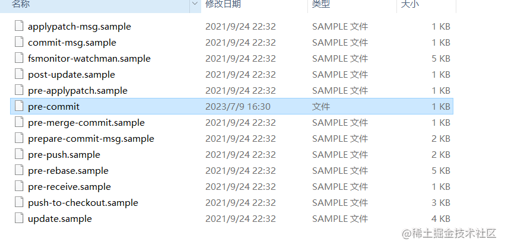
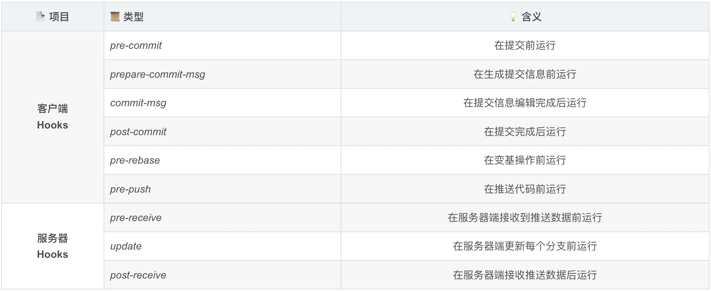

# git

#### git hook 钩子监测

Git 钩子是一组脚本，这些脚本对应着 Git 仓库中的特定事件，每一次事件发生时，钩子会被触发。这允许你可以定制化 Git 的内部行为，在开发周期中的关键点上触发执行定制化的脚本。

#### git 中常用钩子的执行时机以及用途：

-   pre-commit ：在执行提交 (commit) 之前运行。通常用于执行代码风格检查、静态代码分析、单元测试等操作，以确保提交的代码质量。
-   prepare-commit-msg：在提交 (commit) 消息被编辑之前运行。通常用于修改或扩展提交消息，例如添加自动化生成的信息、验证提交消息格式等。
-   commit-msg ：在提交 (commit) 消息被创建后，但提交动作尚未完成时运行。通常用于验证提交消息的格式、内容等是否符合规范。
-   post-commit ：在提交 (commit) 完成后运行。通常用于发送通知、更新文档、执行某些特定的后续处理等操作。
-   pre-rebase ：在执行变基 (rebase) 操作之前运行。通常用于执行一些预检查，例如确保变基操作不会产生冲突或导致代码质量下降。
-   post-checkout ：在检出 (checkout) 完成后运行。通常用于执行一些与工作目录切换相关的操作，例如更新依赖、清理临时文件等。
-   post-merge ：在合并 (merge) 完成后运行。通常用于执行一些与合并操作相关的操作，例如重新构建项目、更新子模块等。
-   pre-push ：在执行推送 (push) 之前运行。通常用于执行一些预检查，例如运行测试、检查代码质量等。
-   pre-receive（服务端钩子） ：在远程仓库接收到推送 (push) 之前运行。通常用于执行一些服务端的预检查，例如验证提交的代码是否符合特定规范。
-   update（服务端钩子） ：在推送 (push) 到远程仓库但尚未完成更新时运行。通常用于执行一些与分支更新相关的操作，例如验证提交的代码是否符合特定规范、是否有权限更新等。
-   post-receive（服务端钩子） ：在远程仓库接收到推送 (push) 并完成更新后运行。通常用于执行一些服务端的后续处理，例如自动化部署、更新文档等。

